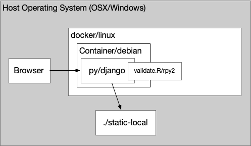

# Test Harness

The test harness provides code necessary to learn, test, and analyze the combination of Gunicorn WSGI, Python Django, RDBMS/Sqlite3, Celery, MongoDB, S3, an R-base modeling environment, and Docker-base containers.

The legacy system uses all of the above technologies. The next generation development seeks to simplify the architecture wherever possible. 

Objectives: better understand legacy system & dependencies. Move to updated versions. Containerize to increase availability of test environments, lower the cost of running the environment, while meeting data security requirements.

## Individual Tests and Protypes 

* Test1 -- Prerequisite python, learning and teaching. Subprocesses as used in legacy architecture were a focus of this phase.  
* Test2 -- (1) Python multiprocess, including processes and threads, (2) Sqlite3 as the key to a more flexible, performant dev environment  
* Test3 -- Mongo and relevant testing -- via pymongo. (Legacy system uses mostly R for mongo). Compares mongo loading & query performance to SQLite, including effects of block sizes (chunks), indexes, concurent clients and other variables.
* Test4 -- AWS S3 development, including multipart python/boto3 with and without threading.
* Test5 -- Rpy2 testing, including plotly to display results and Docker to containerize Python and R scripts.

## Verifying Django

The legacy system relies on Django. Is this still the best choice today for the updated architecture (or, for example, would switching to Flask be justified)?

Application -- Validate the choice of sticking with Django

  * Subprocesses & multiprocess
  * Sqlite3 & Django
  * Celery in Django
  * gunicorn

Summary of Key Benefits of sticking with Django + DjangoRestFramework
    

# Development Environment

Create new development environment on DjangoRestFramework.

* Docker Image for Development:

    

*
*
*

